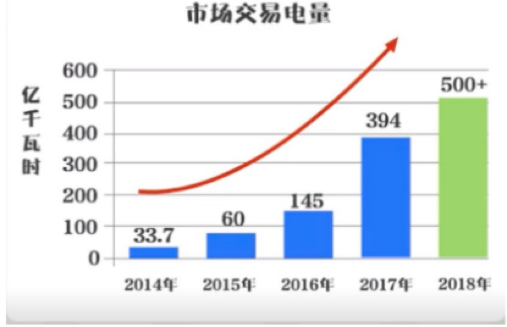

### 电力市场简介

> 电力市场是电能生产者和使用者通过协商、竞价等方式就电能及其相关产品 进行交易，通过市场竞争确定数量和价格的市场

#### 一、政策背景

> 2015 年 3 月，中共中央、国务院印发 《关于进一步深化电力体制改革的若干意 见》（中发 【2015】9号） 新一轮电力体制改革全面铺开，电力市场化改革是电 力体制改革的重要组成部分,其中重要指出

* 坚持社会主义市场经济改革方向 
* 加快有效竞争的市场机构和市场主体
* 形成主要由市场决定能源价格的机制 
* 建立电力交易平台 
* 打破市场壁垒
* 无歧视开放电网
* 最终建立以中长期交易为主、现货交易为补充的市场化电力电量平衡机制
* 以中长期交易规避风险，以现货市场发现价格，交易品种齐全、功能完善的电力市场 
* 电力市场主要由中长期市场、现货市场组成 
    * 中长期市场 
        * 主要开展多年、年、季、月、周等日以上电能量交易
        * 可中断负荷、调压等辅助服务交易 
    * 现货市场
        * 主要开展日前、日内、实时电能量交易和备用、调频等辅助服务交易 
        * 条件成熟:探索开展容量市场、电力期货和衍生品等交易

#### 二、市场主体

* 发电企业
* 电网企业
* 售电企业
* 电力用户
* 独立辅助服务提供者
* 符合国家技能减排和环保要求、产业政策要求、在交易机构注册

> 目前在交易中心注册的市场主体已超过 3200 家，其中发电企业超过 40 家， 电网企业 3 家，售电企业超过 130 家，电力用户超过 3000 家

#### 三、市场规则

* 主要参照
    * 《关于进一步深化电力体制改革若干意见》
    * 《电力中长期交易基本规则（暂行）》
    * 《广西电力体制改革综合试点方案》
* 各省局
    * 国家能源局南方监管局
    * 自治区工业和信息化厅
    * 自治区发展和改革委员会
        * 联合制定  《广西电力中长期交易基本规则（暂行）》
            * 规范广西电力市场化交易
            * 维护市场秩序
        * 自治区工业和信息化厅发布《广西电力市场交易实施方案和实施细则》指导
            * 全年电力市场化交易
            * 注册管理
            * 交易合同管理
            * 结算管理
            * 信息披露
            * 信用管理
#### 四、近几年市场规模

* 交易电量累计突破 1000 亿千瓦时 
* 交易电量连续四年翻番

* 累计降低企业购电成本超过 80 亿元

#### 五、交易品种

* 直接交易(指本省（区）的售电主体和购电主体间的电能量交易)
    * 年度长协
        * 通过双边协商、挂牌等方式达成年度交易电量及分月计划、交 易价格，一般当年底组织次年用电交易，一年开展一次 
    * 月度竞价
        * 指月度组织的购售双方申报电量电价，有交易平台按照一定规则统一撮合出清的电能量交易 
    * 专场（增量）交易 
        * 根据市场主体需要（大电量交易需求、增量用电交易需求）等 特别组织的电能量交易
        * 一般通过双边协商、挂牌等方式组织
* 跨区跨省交易(指双方分属不同发电调度控制区，一般指不同省区的电能及其相关产品)交易
    * 跨区跨省协议计划
    * 直接交易
    * 增量外送
    * 发电合同转让
    * 合同回购
* 合同电量转让交易(已确立的购售电合同的权益转让交易)，主要包括 
    * 优先发电合同
    * 基数电量合同
    * 直接交易合同
    * 跨区跨省交易合同
* 辅助服务补偿（交易）机制 (采用竞争方式确定辅助服务提供主体)
    * 可中断负荷 
    * 调压
    * 调频
    * 备用
    * 黑启动
    * 无功调节
    * 自动发电控制
    * 自动电压控制
    * 对提供有偿辅助服务的并网发电厂、电力用户、独立 辅助服务者进行补偿的交易机制

#### 六、交易方式

* 双边协商 
    * 购售（转让）双方通过协商方式确定合同意向,提交电力交易中心备案的交易方式
* 集中竞价 
    * 购售双方在交易平台申报交易标的，交易平台按照统一规则撮合出清交易结果 
* 挂牌
    * 市场主体以缔结合同为目的，在交易平台提出拟交易的标的和条件（电 量、电价等）、接受竞买卖人的成交申请 、按照一定规则确定竞买卖人和标的量的交易方式